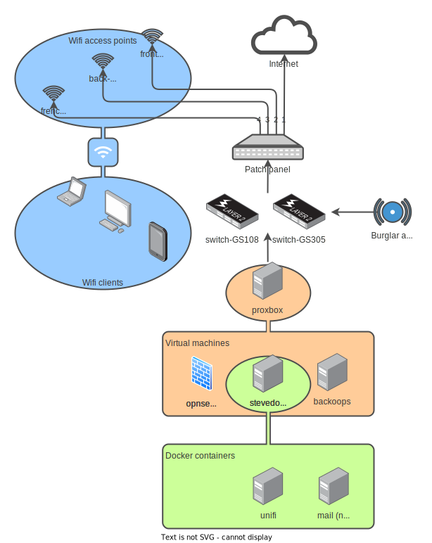

<!-- markdownlint-disable MD033 -->
<h1>Leigh Delamere network documentation</h1>
<!-- markdownlint-enable MD033 -->

This page contains an overview of the Leigh Delamere network.

These docs are hosted at [https://docs.leigh.delamere.dvlp.casa/](https://docs.leigh.delamere.dvlp.casa/).

Documentation is maintained by Freddie - please notify him of any changes.

<!-- markdownlint-disable MD033 -->
<h2>Contents</h2>
<!-- markdownlint-enable MD033 -->

- [Network diagram](#network-diagram)
  - [Network description](#network-description)
- [IP addressing](#ip-addressing)
  - [Subnets](#subnets)
  - [Hosts and services](#hosts-and-services)
  - [Management URLs](#management-urls)
- [Passwords](#passwords)
- [Wifi](#wifi)
- [VPN](#vpn)
  - [Windows](#windows)
  - [Linux](#linux)
- [Remote support](#remote-support)
- [Hardware](#hardware)
  - [proxbox](#proxbox)
  - [harriet-desktop](#harriet-desktop)
  - [switch-GS108](#switch-gs108)
- [Backups](#backups)
  - [Restore](#restore)

This page is an overview. There is more detail at:

- [switch](switch.md)
- [proxbox](proxbox.md)
- [opnsense](opnsense.md)
- [backoops](backoops.md)
- [unifi](unifi.md)

## Network diagram

### Network description

The network is segmented into four zones using 802.1Q VLANs configured on the NetGear switch.

There is a virtual host, `proxbox`, running on a Dell Optiplex, which hosts a virtual firewall, `opnsense`. The virtual host is connected to a trunk port on the switch, which is tagged with all VLANs. The virtual host untags the VLANs so that the VMs do not need to be VLAN-aware.

Traffic from the subnets goes through the trunked port to the virtual firewall to be routed to the internet or to other subnets - a "router-on-a-stick" configuration.

Also running on the virtual host is a docker host, `stevedore`, which hosts the containerised wifi controller. There is headroom on this host for other containerised services.

Also running on the virtual host is a backup server, `backoops`, which hosts backup for the VMs and for `harriet-desktop`.

The ISP is Gigaclear and the demarc point is in the green study at the front of the house. Structured cabling goes out at the same point, runs around the front of the house, and into the house again through the front loo, via the larder, and under the back stairs to the patch panel. More structured cabling runs throughout the house to the wifi access points (WAPs). The WAPs are powered over this cabling by the Netgear switch, which offers 4 ports of PoE. Each WAP draws up to 13W.

Known issue: the cable to the front stairs will not negotiate gigabit. It should be replaced, but this is not urgent.

The wifi is an Ubiquiti system with U6-Pro access points.

## IP addressing

### Subnets

| Subnet      | VLAN ID | Purpose   |
|-------------|---------|-----------|
| 10.5.5.0/24 | N/A     | VPN       |
| 10.6.6.0/24 | 6       | WAN       |
| 10.6.6.0/24 | 7       | Trusted   |
| 10.6.6.0/24 | 8       | Untrusted |
| 10.6.6.0/24 | 9       | Management|

### Hosts and services

| Hostname         | IP         | OS          | Description         |
|------------------|------------|-------------|---------------------|
| opnsense         | 10.9.9.1   | OPNsense    | Firewall / router   |
| proxbox          | 10.9.9.2   | Proxmox VE  | Virtual host        |
| stevedore        | 10.9.9.3   | Ubuntu      | Docker host         |
| backoops         | 10.9.9.4   | Proxmox BE  | Backup server       |
| unifi            | 10.9.9.9   | Docker      | Unifi controller    |
| switch-GS108     | 10.9.9.10  |             | Switch / PoE        |
| mail             | 10.9.9.25  | Docker      | SMTP relay          |
| french-room-ap   | 10.7.7.97  |             | Unifi access point  |
| back-stairs-ap   | 10.7.7.98  |             | Unifi access point  |
| front-stairs-ap  | 10.7.7.99  |             | Unifi access point  |

### Management URLs

| Service  | URL |
|----------|-----|
| Firewall | [opnsense.leigh.delamere](https://opnsense.leigh.delamere) |
| Proxmox  | [proxbox.leigh.delamere](https://proxbox.leigh.delamere) |
| Backup   | [backoops.leigh.delamere](https://backoops.leigh.delamere) |
| Unifi    | [unifi.leigh.delamere](https://unifi.leigh.delamere) |
| Switch   | [switch-GS108.leigh.delamere](http://switch-GS108.leigh.delamere) |

## Passwords

All credentials are hosted in [Bitwarden](https://vault.bitwarden.com). Contact Harriet or Freddie for access.

## Wifi

The goal is to provide usable wifi, not good wifi, in all areas of the house. The walls are 300-500mm thick. Fortunately, the floors are reasonably permeable.

Ubiquiti was chosen for its auto-learning, sensible defaults, centralised management, broad availability, and quality of AP for the price. The access points are U6-Pro; these were chosen for their highly omni-directional beam pattern.

> Do not crank up the transmitter power to improve wifi. This can have a detrimental effect, because the client devices may receive better but they can't transmit better. They merely take longer to disconnect from a weak AP and rehome to a closer one.
>
> The only way to improve wifi quality is to add more APs.

## VPN

There's a VPN for remote support. The files are here:

- [Leigh_Delamere.ovpn](./VPN_client_config/Leigh_Delamere.ovpn)
- [Leigh_Delamere.crt](./VPN_client_config/Leigh_Delamere.crt)

### Windows

Tested on Windows 11 with OpenVPN Community 2.6.6-I001:

1. Install OpenVPN Community Edition (not Connect) from [openvpn.net](https://openvpn.net/community-downloads/) or with `winget install OpenVPNTechnologies.OpenVPN`
    - OpenVPN Connect 3.4.2 doesn't respect the DNS servers pushed from OpnSense 23.7; that's why this doc specifies Community Edition.
    - If installation fails with an error about TAP drivers, try excluding `Wintun`
2. Create `OpenVPN\config\Leigh_Delamere` folder in your home folder, e.g. `C:\Users\Freddie\OpenVPN\config\Leigh_Delamere`
3. Copy `Leigh_Delamere.ovpn` and `Leigh_Delamere.crt` to the config folder, so you have e.g. `C:\Users\Freddie\OpenVPN\config\Leigh_Delamere\Leigh_Delamere.ovpn`
4. Start `OpenVPN GUI`
5. Right-click on the systray icon > `Connect`

### Linux

Tested on Ubuntu 23.10 with OpenVPN 2.6.5:

1. Put both files (`Leigh_Delamere.ovpn` and `Leigh_Delamere.crt`) somewhere
2. `openvpn --config ./Leigh_Delamere.ovpn`
3. Put username and password on separate lines in `./vpn-passwd`
4. `openvpn --config ./Leigh_Delamere.ovpn --auth-user-pass ./vpn-passwd`

## Remote support

1. Connect to VPN
2. Connect to `harriet-desktop.leigh.delamere` over VNC
    - [RealVNC] is a usable and free VNC client for Windows: `winget install RealVNC.VNCViewer`
3. If name resolution fails, you can get the IP address from `opnsense`; look in `Services` > `DHCPv4` > `Leases`.
4. For passwords, see [Passwords](#passwords).

## Hardware

### proxbox

- Dell OptiPlex 7050
- Service tag: `C7DPGL2`
- 256GB SATA SSD for OS and VMs
- 1TB NVMe SSD for backups

### harriet-desktop

- Dell OptiPlex 3070
- Service tag: `4BVL423`
- 256GB M2 SATA SSD for OS
- 1TB spinning HD for `/home/harriet` and for Timeshift system snapshots

### switch-GS108

- NetGear GS108PEv3
- Serial: `3UJ25B520320A`

## Backups

`opnsense` and `stevedore` VMs are backed up weekly to `backoops`. `backoops` is backed up weekly to local storage on `proxbox`, excluding the backup disk.

`harriet-desktop` backs up nightly at 03:00. This backup includes `/home/harriet` and the Timeshift system snapshot.

### Restore

- `proxbox` _assuming the OS/VM disk is hosed_
  - Reinstall `Proxmox VE` on bare metal, following the notes at [proxbox](proxbox.md)
  - Create a VM and install `Proxmox Backup Server`
  - Add the backup disk to VE and attach the virtual disk in it to the backup VM
  - In the backup VM, attach the existing datastore from the virtual disk
  - In VE, add the backup server datastore as storage
  - Restore VMs from backup

- `opnsense`
  - Log into `proxbox`
  - Restore VM from backup

- `stevedore`
  - Log into `proxbox`
  - Restore VM from backup
  - Alternatively, create a new VM, install Ubuntu and re-run ansible (see steps for `harriet-desktop`)

- `backoops`
  - Log into `proxbox`
  - Restore VM from backup

- `harriet-desktop`
  - Single files:
    - Open the `backoops` management page and navigate to the datastore
    - Expand the backup
    - Download the required file(s)
  - System snapshot:
    - Open `Timeshift`
    - Restore from existing snapshot
  - Full OS:
    - Install Linux Mint Victoria
    - `git clone`, or just download and extract, the [leigh-delamere git repo](https://github.com/fsackur/leigh-delamere)
    - Run the `run_ansible.sh` script
    - Disable the nightly backup: `sudo systemctl disable proxmox-backup.timer`
    - Use `proxmox-backup-client restore` to restore from backup
      - refer to `/etc/proxmox-backup/proxmox-backup.sh` and `proxmox-backup.env` for context
    - Re-enable the nightly backup: `sudo systemctl enable proxmox-backup.timer`
